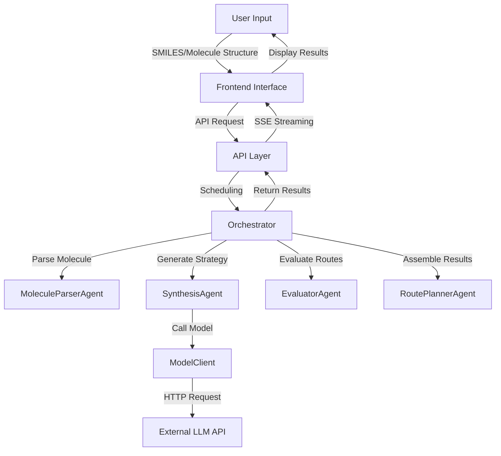

# RetrosynthesisClaw

A modular multi-agent retrosynthesis scaffold for complex organic synthesis planning, powered by large language models.

## Project Overview

RetrosynthesisClaw is an intelligent molecular synthesis planning system that integrates advanced large language models (LLMs) with chemical knowledge to provide automated synthesis route design services for organic chemists. The system adopts a multi-agent architecture, capable of generating high-quality synthesis routes and providing detailed synthetic strategy analysis.

**Core Values**:
- Intelligent synthesis planning: Utilizes large language models to generate high-quality synthesis routes
- Multi-route evaluation: Simultaneously generates multiple synthesis routes and evaluates their feasibility
- Detailed synthetic strategies: Provides detailed synthesis strategies and step-by-step analysis for each route
- User-friendly interface: Intuitive frontend interface with molecule structure visualization
- Real-time streaming response: Uses Server-Sent Events (SSE) to provide real-time synthesis progress

## Core Features

### 1. Intelligent Synthesis Planning
- Synthesis route generation based on large language models
- Support for multiple synthesis strategies and reaction types
- Automatic handling of complex molecular structures

### 2. Synthetic Strategy Generation
- Detailed English synthetic strategies for each route
- Includes reaction step analysis and synthetic principles
- Provides approximately 200-word detailed explanations

### 3. Multi-route Evaluation
- Generates multiple synthesis routes simultaneously
- Comprehensive scoring based on confidence and step count
- Displays routes sorted by feasibility

### 4. Detailed Reaction Conditions
- Provides specific reaction conditions for each step
- Includes reaction type, reagents, solvents, and other information
- Provides reaction principle explanations

### 5. Yield Prediction
- Integrated yield prediction model
- Provides yield estimates for each reaction step
- Helps evaluate the practical feasibility of routes

### 6. Molecule Structure Visualization
- Supports SMILES input and molecule editor
- Real-time generation of molecule structure diagrams
- Intuitive display of reactants and products

## Technical Architecture



### Key Components

| Component | Responsibility | Implementation File |
|-----------|----------------|---------------------|
| **Orchestrator** | Coordinates the entire synthesis process | `src/retrosynthesis_claw/orchestrator.py` |
| **MoleculeParserAgent** | Molecule parsing and standardization | `src/retrosynthesis_claw/agents.py` |
| **SynthesisAgent** | Synthesis planning | `src/retrosynthesis_claw/agents.py` |
| **EvaluatorAgent** | Route evaluation | `src/retrosynthesis_claw/agents.py` |
| **RoutePlannerAgent** | Result assembly | `src/retrosynthesis_claw/agents.py` |
| **ModelClient** | Model calling | `src/retrosynthesis_claw/model_client.py` |
| **API Layer** | Interface services | `src/retrosynthesis_claw/api.py` |
| **Frontend** | User interface | `frontend/` |
| **Yield Predictor** | Yield estimation | `src/retrosynthesis_claw/yield_predictor/` |
| **SMILES Repair** | SMILES string correction | `src/retrosynthesis_claw/smiles_repair.py` |

## Installation Steps

### Environment Requirements

- Python 3.9 or higher
- Git
- Modern browser (Chrome/Firefox/Edge)

### Installation Method

1. **Clone the project**

```bash
git clone https://github.com/yourusername/RetrosynthesisClaw.git
cd RetrosynthesisClaw
```

2. **Install dependencies**

```bash
pip install -e .
```

3. **Configure API key**

Copy the `.env.example` file and rename it to `.env`, then fill in your API key:

```
# .env file content
GEMINI_API_KEY=your_api_key_here
```

## Configuration Method

### Main Configuration Files

- **`.env`**: Environment variable configuration, including API keys
- **`configs/default.yaml`**: System default configuration
- **`configs/api_config.json`**: API-related configuration

### Configuration Options

| Configuration Item | Description | Default Value |
|-------------------|-------------|---------------|
| `top_k` | Number of synthesis routes to generate | 3 |
| `min_route_steps` | Minimum synthesis steps | 3 |
| `timeout_seconds` | API timeout time | 300 |
| `model_name` | LLM model to use | gemini-2.5-flash-lite |

## Usage Examples

### Method 1: Through Frontend Interface

1. **Start the backend service**

```bash
# Windows
python -m uvicorn retrosynthesis_claw.api:app --host 0.0.0.0 --port 8000 --reload

# Mac/Linux
python3 -m uvicorn retrosynthesis_claw.api:app --host 0.0.0.0 --port 8000 --reload
```

2. **Access the frontend interface**

Open your browser and visit `http://localhost:8000`

3. **Input target molecule**

- Directly input SMILES: `BrC1=C2CCCOC2=NC=C1`
- Or use the molecule editor to draw the structure

4. **Generate synthesis routes**

Click the "Start Analysis" button, and the system will begin generating synthesis routes

### Method 2: Through API Call

```python
import requests
import json

url = "http://localhost:8000/route"
payload = {
    "target": "BrC1=C2CCCOC2=NC=C1",
    "top_k": 2
}

response = requests.post(url, json=payload)
result = response.json()

print(f"Generated {result['route_count']} routes")
print(f"Primary route score: {result['primary_route']['total_score']}")
```

### Method 3: Using Example Scripts

Check the `examples/` directory for usage examples:

```bash
python examples/api_example.py
```

## API Documentation

### 1. `/health`

**Method**: GET
**Description**: Health check endpoint
**Return**: `{"status": "ok"}`

### 2. `/route`

**Method**: POST
**Description**: Generate synthesis routes
**Parameters**:
- `target`: SMILES or molecule structure of the target molecule
- `top_k`: Number of routes to generate (default 3)
- `debug`: Whether to enable debug mode (default false)

**Return**:
```json
{
  "result": "success",
  "synthesis_route": [...],
  "route_count": 2,
  "primary_route": {...}
}
```

### 3. `/route/stream`

**Method**: POST
**Description**: Stream synthesis route generation (real-time progress)
**Parameters**: Same as `/route`
**Return**: Server-Sent Events (SSE) stream

## Project Structure

```
RetrosynthesisClaw/
├── src/                  # Source code
│   └── retrosynthesis_claw/  # Core code
│       ├── agents.py     # Various Agent implementations
│       ├── api.py        # API interface
│       ├── orchestrator.py # Process orchestration
│       ├── model_client.py # Model calling
│       ├── yield_predictor/ # Yield prediction
│       └── ...
├── frontend/             # Frontend code
│   ├── index.html        # Main page
│   ├── script.js         # Frontend script
│   └── styles.css        # Style files
├── configs/              # Configuration files
├── tests/                # Test scripts
├── docs/                 # Documentation
├── examples/             # Usage examples
├── scripts/              # Utility scripts
├── records/              # Project records and documents
├── public/               # Public resources
├── .env                  # Environment variables
├── .env.example          # Environment variables example
├── .gitignore            # Git ignore file
├── LICENSE               # License file
├── README.md             # Project description
└── pyproject.toml        # Project metadata
```

## Testing

### Run Tests

```bash
# Run a single test
python tests/test_api.py

# Run multiple tests
python tests/test_complete_flow.py
```

### Test File Description

- `test_api.py`: API interface tests
- `test_complete_flow.py`: Complete synthesis flow tests
- `test_strategy.py`: Synthetic strategy generation tests
- `test_model_client.py`: Model client tests
- `test_yield_predictor.py`: Yield predictor tests

## Contribution Guidelines

### Development Process

1. **Fork the project**
2. **Create a branch**: `git checkout -b feature/your-feature`
3. **Commit changes**: `git commit -m "Add your feature"`
4. **Push branch**: `git push origin feature/your-feature`
5. **Create Pull Request**

### Code Standards

- Follow PEP 8 coding standards
- Use type annotations
- Write clear docstrings
- Add unit tests

### Report Issues

If you find any issues, please report them in GitHub Issues, including:
- Issue description
- Reproduction steps
- Expected behavior
- Actual behavior
- Environment information

## License

This project is licensed under the MIT License. See the `LICENSE` file for details.

## Technical Support

## Model Files

This project requires model files for the Yield Prediction and SMILES Repair components. Due to file size limitations, models are hosted on GitHub Releases.

### Download Instructions

1. Go to the [Latest Release](https://github.com/lipz666/RetrosynthesisClaw/releases/latest)
2. Download the following files:
   - **`models.zip`** - Yield Prediction Models
   - **`final_model.zip`** - SMILES Repair Model

### Installation Steps

1. Download both zip files from the release page
2. Extract to the appropriate directories:
   - **`models.zip`** → Extract to `public/Yieldpredict/` (will create `models/` subdirectory)
   - **`final_model.zip`** → Extract to `smiles/smiles/runs/chemberta2_repair/` (will create `final_model/` subdirectory)

3. Verify the extracted file structure:
   ```
   public/Yieldpredict/models/
   ├── residual_quantile_ydr_artifact.json
   ├── residual_quantile_ydr_rf.zip
   └── other model files
   
   smiles/smiles/runs/chemberta2_repair/final_model/
   ├── model.safetensors
   ├── tokenizer.json
   ├── vocab.json
   └── other config files
   ```

### Testing

To verify the installation, test with the molecule:
- **SMILES**: `BrC1=C2CCCOC2=NC=C1`
- **Expected**: System should generate synthesis routes successfully

Start the servers and access `http://localhost:8000` to use the frontend interface.

- **Documentation**: Check the documentation in the `docs/` directory
- **Examples**: Check the example scripts in the `examples/` directory
- **Issues**: Ask questions in GitHub Issues

## Acknowledgments

- Thanks to the Google Gemini team for providing large language models
- Thanks to the RDKit team for providing molecular processing tools
- Thanks to all contributors for their efforts

## Version Information

**Current version**: 0.1.0

**Changelog**:
- v0.1.0: Initial version, implementing core features
  - Multi-agent synthesis planning
  - Synthetic strategy generation
  - Real-time streaming response
  - Frontend interface
  - Yield prediction integration

---

*RetrosynthesisClaw - The Future of Intelligent Molecular Synthesis Planning*