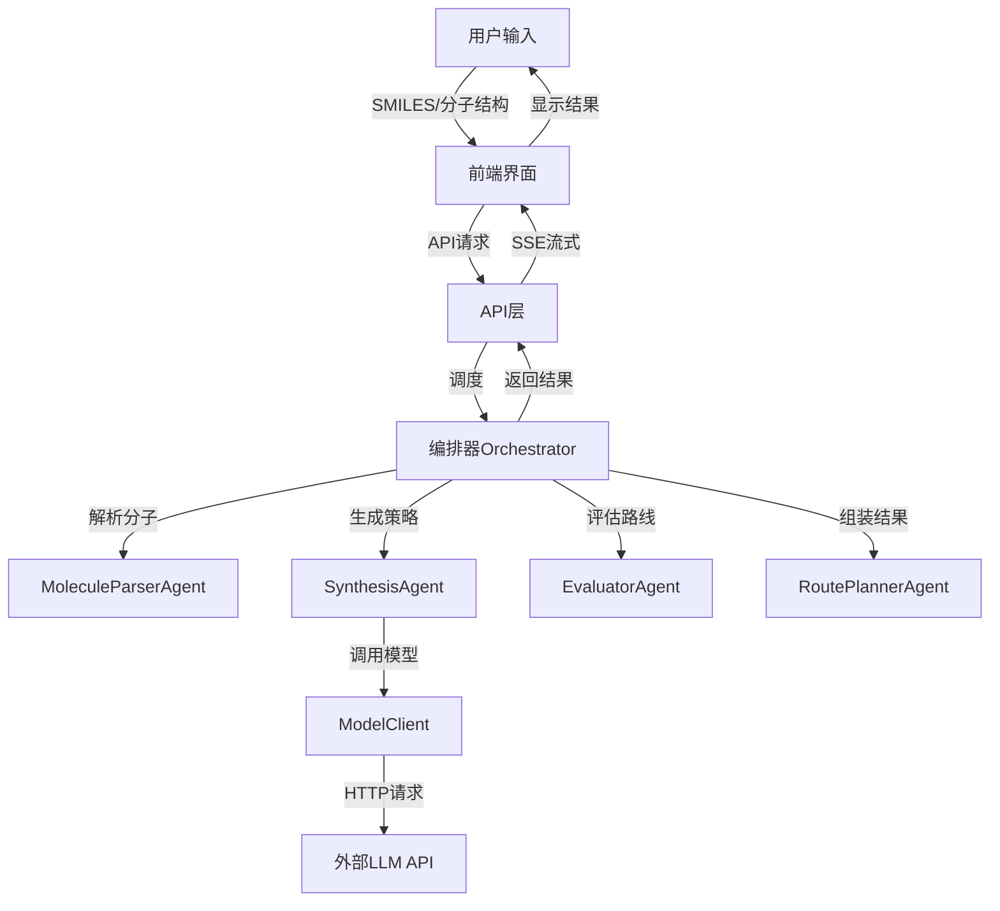
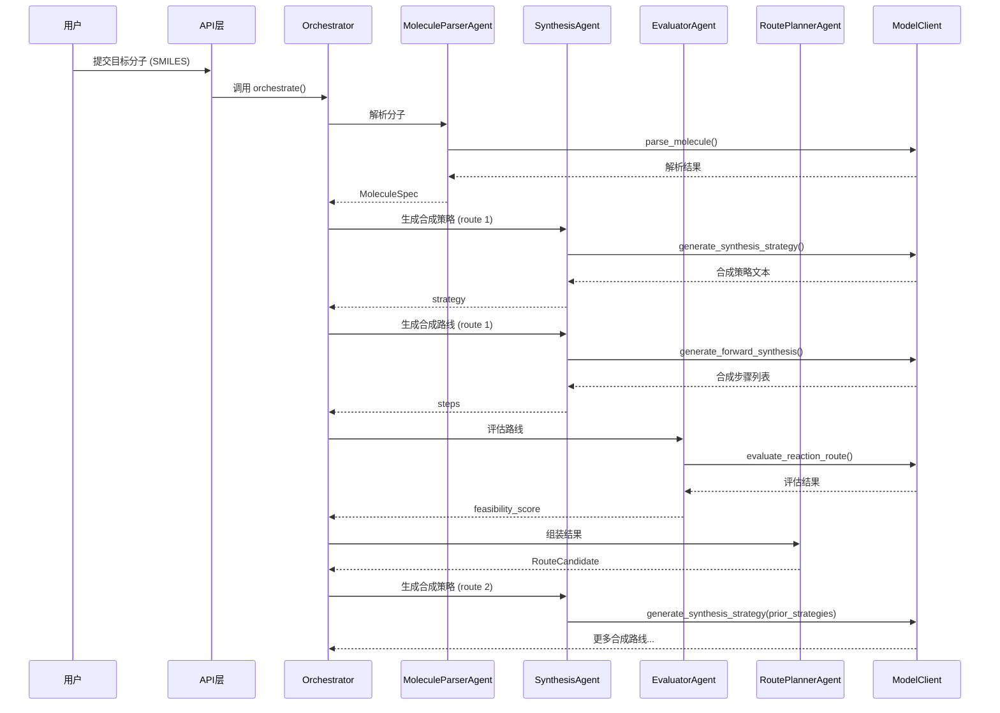
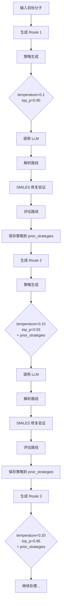
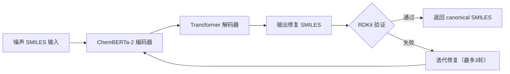
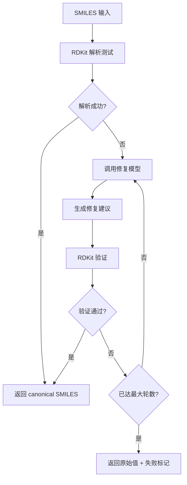
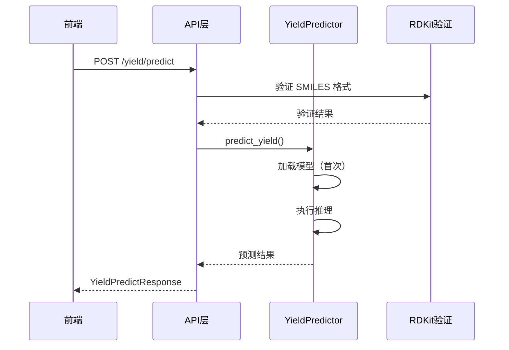
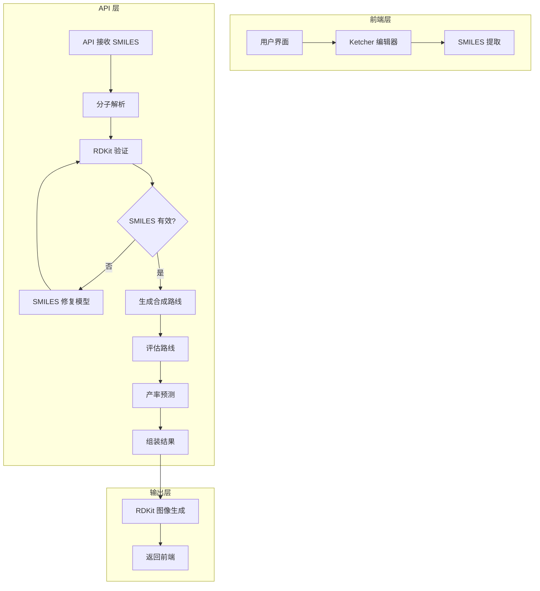

# RetrosynthesisClaw 项目工作流程文档

## 1. 项目概述

### 1.1 项目定位

RetrosynthesisClaw 是一个基于大语言模型（LLM）的智能逆合成规划系统，旨在为有机化学家提供自动化的分子合成路线设计服务。该系统通过 AI 驱动的合成规划，帮助用户快速生成多种可行的合成路线，并提供详细的合成思路和步骤分析。

### 1.2 核心价值

- **智能化合成规划**：利用先进的大语言模型生成高质量的合成路线
- **多路线评估**：同时生成多条合成路线并进行可行性评估
- **详细合成思路**：每条路线提供详细的合成策略和步骤分析
- **用户友好界面**：直观的前端界面，支持分子结构可视化
- **实时流式响应**：采用 Server-Sent Events (SSE) 提供实时合成进度

### 1.3 技术架构



## 2. 核心工作流程

### 2.1 整体流程

RetrosynthesisClaw 的工作流程遵循以下步骤：

1. **输入处理**：用户输入目标分子的 SMILES 或通过分子编辑器绘制结构
2. **分子解析**：MoleculeParserAgent 使用 LLM API 解析并标准化输入分子
3. **合成策略生成**：SynthesisAgent 中的策略生成模块使用 LLM API 为每个路线生成合成思路
4. **合成路线生成**：SynthesisAgent 中的路线执行模块使用 LLM API 生成详细的合成步骤
5. **路线评估**：EvaluatorAgent 使用 LLM API 评估每条路线的可行性
6. **结果组装**：RoutePlannerAgent 组装完整的合成路线
7. **结果返回**：通过 SSE 流式返回结果到前端
8. **前端展示**：显示合成路线、合成思路和详细步骤

### 2.2 详细步骤说明

#### 步骤 1: 用户输入

- **输入方式**：
  - 直接输入 SMILES 字符串
  - 使用内置的 Ketcher 分子编辑器绘制结构
  - 从外部文件导入分子结构

- **输入验证**：
  - 前端实时验证输入格式
  - 后端进行分子有效性检查

#### 步骤 2: 分子解析 (MoleculeParserAgent)

```python
# 分子解析流程
def run(self, input_text: str) -> MoleculeSpec:
    # 1. 调用 LLM API 进行分子解析
    parsed_result = self.model_client.parse_molecule(
        input_text,
        context="mode=molecule_parsing"
    )
    
    # 2. 提取解析结果
    return MoleculeSpec(
        input_text=input_text,
        smiles=parsed_result.get("smiles", ""),
        canonical_smiles=parsed_result.get("canonical_smiles", ""),
        source_type=parsed_result.get("source_type", "smiles"),
        valid=parsed_result.get("valid", False),
        metadata=parsed_result.get("metadata", {})
    )
```

**关键功能**：
- 使用 LLM API 处理各种输入格式（SMILES、IUPAC 名称等）
- 自动修复无效或不规范的 SMILES
- 标准化分子表示
- 提供详细的解析元数据，包括结构分析和片段化建议

#### 步骤 3: 合成策略生成 (SynthesisAgent)

```python
# 合成策略生成
def generate_strategy(self, target: MoleculeSpec, route_seed: int = 0) -> Dict[str, Any]:
    return self.model_client.generate_synthesis_strategy(
        target.canonical_smiles,
        context=f"seed={route_seed};mode=synthesis_strategy",
    )
```

**生成内容**：
- 目标分子结构分析
- 预计合成步骤数
- 关键合成步骤及其原理
- 合成策略的合理性说明
- 英文输出（约 200 词）

#### 步骤 4: 合成路线生成 (SynthesisAgent)

```python
# 合成路线生成
def run(self, target: MoleculeSpec, min_steps: int, route_seed: int = 0) -> List[SynthesisStep]:
    # 1. 根据分子复杂度确定最大步骤数
    smiles_length = len(target.canonical_smiles)
    if smiles_length < 10: max_steps = 3
    elif smiles_length < 30: max_steps = 5
    else: max_steps = 7

    # 2. 调用 LLM 生成合成路线
    proposal = self.model_client.generate_forward_synthesis(
        target.canonical_smiles,
        context=f"seed={route_seed};mode=forward_synthesis",
    )

    # 3. 解析和处理合成步骤
    steps: List[SynthesisStep] = []
    if isinstance(proposal.get("route"), list):
        for idx, step_data in enumerate(proposal["route"]):
            # 处理每步的反应物、产物、条件等
            # 修复 SMILES
            # 丰富反应条件
            steps.append(...)

    # 4. 降级方案：顺序生成步骤
    if not steps:
        steps = self._generate_steps_sequentially(target, max(min_steps, 2), route_seed)

    return steps
```

**每步包含**：
- 反应物 SMILES (`input_smiles`)
- 产物 SMILES (`product_smiles`)
- 反应类型 (`reaction_type`)
- 反应条件 (`conditions`)
- 反应原理 (`rationale`)
- 置信度 (`confidence`)
- 详细元数据 (`metadata`)

#### 步骤 5: 路线评估 (EvaluatorAgent)

```python
# 路线评估
def run(self, target: MoleculeSpec, steps: List[SynthesisStep]) -> float:
    if not steps:
        return 0.0
    
    # 1. 调用 LLM API 评估路线
    evaluation_result = self.model_client.evaluate_reaction_route(
        target.canonical_smiles,
        [{
            "input_smiles": step.input_smiles,
            "product_smiles": step.product_smiles,
            "reaction_type": step.reaction_type,
            "conditions": step.conditions
        } for step in steps],
        context="mode=route_evaluation"
    )
    
    # 2. 提取评估分数
    return evaluation_result.get("feasibility_score", 0.0)
```

**评估指标**：
- 反应可行性：每步反应的化学合理性
- 路线连贯性：步骤之间的逻辑衔接
- 条件可行性：反应条件的实际可操作性
- 底物兼容性：反应物之间的兼容性
- 官能团耐受性：官能团在反应条件下的稳定性
- 最终评分：0.0-1.0，越高表示可行性越好

#### 步骤 6: 结果组装 (RoutePlannerAgent)

```python
# 结果组装
def run(self, target: MoleculeSpec, steps: List[SynthesisStep], score: float, route_index: int = 1) -> RouteCandidate:
    return RouteCandidate(
        route_id=f"route-{route_index}",
        target_smiles=target.canonical_smiles,
        steps=steps,
        total_score=round(score * 100, 2),
        feasibility_score=score,
        route_notes=[f"Generated by the scaffold planner (route {route_index}).", self.system_prompt.splitlines()[0]],
        metadata={
            "min_route_policy": True,
            "route_index": route_index,
            "system_prompt": self.system_prompt,
            "synthesis_strategy": strategy  # 存储合成思路
        },
    )
```

**组装内容**：
- 路线 ID 和索引
- 目标分子 SMILES
- 完整合成步骤列表
- 路线评分（百分制）
- 可行性评分
- 路线说明和元数据
- 合成思路

#### 步骤 7: 结果返回

- **流式响应**：使用 Server-Sent Events (SSE) 实时返回进度
- **事件类型**：
  - `progress`：合成进度更新
  - `target`：目标分子解析结果
  - `route`：合成路线生成
  - `complete`：合成完成

#### 步骤 8: 前端展示

- **路线选择**：通过标签页切换不同合成路线
- **合成思路**：每条路线顶部显示英文合成策略
- **步骤展示**：可视化每步的反应物、产物和条件
- **分子图像**：使用 RDKit 生成分子结构图
- **产率预测**：为每步反应预测产率

## 3. 关键角色与职责

| 角色 | 职责 | 实现文件 | 核心功能 |
|------|------|----------|----------|
| **Orchestrator** | 协调整个合成流程 | `orchestrator.py` | 调度各 Agent，管理工作流 |
| **MoleculeParserAgent** | 分子解析与标准化 | `agents.py` | 处理输入，修复 SMILES |
| **SynthesisAgent** | 合成规划 | `agents.py` | 生成合成策略和路线 |
| **EvaluatorAgent** | 路线评估 | `agents.py` | 评估路线可行性 |
| **RoutePlannerAgent** | 结果组装 | `agents.py` | 组装完整合成路线 |
| **ModelClient** | 模型调用 | `model_client.py` | 调用外部 LLM API |
| **API层** | 接口服务 | `api.py` | 处理 HTTP 请求，流式响应 |
| **前端** | 用户界面 | `frontend/script.js` | 提供交互界面，展示结果 |

## 4. Agent 协作工作流详解

### 4.1 Agent 通信机制

RetrosynthesisClaw 采用事件驱动的协作模式，各 Agent 通过 Orchestrator 进行协调，所有 Agent 现在都使用 LLM API 实现核心功能：



### 4.2 各 Agent 职责详解

#### 4.2.1 MoleculeParserAgent - 分子解析专家

**核心职责**：
- 使用 LLM API 验证输入分子的化学有效性
- 标准化 SMILES 表示
- 修复无效或格式错误的 SMILES
- 提供详细的解析元数据，包括结构分析和片段化建议

**决策规则**：
```
输入验证流程:
1. 调用 LLM API 进行分子解析和标准化
2. 提取 LLM 返回的解析结果
3. 验证返回的 SMILES 格式
4. 提供详细的分子结构分析和片段化建议
```

**输出规范**：
```python
MoleculeSpec(
    input_text=str,          # 原始输入
    smiles=str,              # 修复后的 SMILES
    canonical_smiles=str,    # 规范化 SMILES
    source_type=str,         # 输入来源类型
    valid=bool,              # 是否有效
    metadata=dict            # 详细元数据
)
```

#### 4.2.2 SynthesisAgent - 合成规划核心

SynthesisAgent 由两个关键模块组成：

**1. 策略生成模块**
- 为每条路线生成合成策略（英文，约200词）
- 分析目标分子结构特点
- 确定合成切入点和关键步骤
- 预估合成步骤数
- 生成英文合成思路说明

**2. 路线执行模块**
- 基于策略生成详细的正向合成步骤
- 处理 LLM 返回的原始响应
- 调用 SMILES 修复模型验证和修正
- 确保合成步骤的化学合理性

**决策规则**：
```
合成策略生成:
1. 收集前序路线的合成策略 (prior_strategies)
2. 构建包含历史策略的提示词
3. 约束 LLM 避免重复相似的合成切入点
4. 根据 route_index 调整 temperature/top_p

合成路线生成:
1. 根据分子长度确定最大步骤数
2. 调用 LLM 生成完整路线
3. 解析返回的 JSON route 数据
4. 对每步进行 SMILES 修复（最多3轮）
5. 若解析失败，启用降级方案（顺序生成）
```

#### 4.2.3 EvaluatorAgent - 路线评估专家

**核心职责**：
- 使用 LLM API 评估合成路线的可行性
- 分析每步反应的化学合理性
- 评估路线的整体连贯性和可行性
- 计算综合评分
- 提供详细的评估反馈给 Orchestrator

**评分机制**：
- 调用 LLM API 对路线进行全面评估
- 分析反应可行性、条件合理性、底物兼容性等
- 生成 0.0-1.0 的可行性评分
- 提供详细的评估理由和改进建议

#### 4.2.4 RoutePlannerAgent - 结果组装专家

**核心职责**：
- 组装完整的合成路线候选
- 整合所有元数据
- 准备前端展示格式

### 4.3 Agent 间信息交换规范

```python
# Orchestrator -> Agent 信息传递
orchestrator.iterate(target_input, top_k=3)

# 事件流结构
OrchestrationEvent(TypedDict):
    type: str           # "progress" | "target" | "route" | "complete"
    state: str          # 编排状态
    message: str        # 状态消息
    target: MoleculeSpec      # 目标分子（可选）
    route: RouteCandidate     # 合成路线（可选）
    route_index: int          # 路线索引（可选）
    route_count: int          # 路线总数（可选）
    strategy: Dict             # 合成策略（可选）
    steps: List[SynthesisStep] # 合成步骤（可选）
    score: float              # 评估分数（可选）
    error: str                # 错误信息（可选）
```

### 4.4 冲突解决策略

当多条路线存在冲突或重复时，系统采用以下策略：

1. **策略差异化**：通过 `prior_strategies` 约束后续路线
2. **参数递增**：后续路线使用更高的 temperature/top_p
3. **评分排序**：最终按可行性评分排序输出
4. **验证过滤**：RouteValidator 过滤无效路线

## 5. 多路线生成策略详解

### 5.1 策略背景

RetrosynthesisClaw 支持同时生成多条不同的合成路线，以提供多样化的合成方案选择。核心挑战在于确保后续路线与前序路线保持差异化，而非简单重复。

### 5.2 上下文集成策略 (Context Integration)

#### 5.2.1 实现机制

当生成第 2 条及后续路线时，系统会将前序路线的合成策略作为上下文传递给 LLM：

```python
# orchestrator.py (第 107-126 行)
prior_strategies: List[str] = []
for route_index in range(1, route_count + 1):
    # 动态调整温度参数
    route_temperature = min(0.1 + 0.05 * (route_index - 1), 0.3)
    route_top_p = min(0.9 + 0.03 * (route_index - 1), 0.98)

    # 生成合成策略（包含前序策略上下文）
    strategy = self.synthesis.generate_strategy(
        target,
        route_seed=route_index,
        context=f"route_index={route_index};route_count={route_count}",
        prior_strategies=prior_strategies,  # 关键：传递前序策略
        temperature=route_temperature,
        top_p=route_top_p,
    )
    # ...
    prior_strategies.append(str(strategy.get("strategy", "")))
```

#### 5.2.2 提示词约束

```python
# agents.py (第 73-84 行)
def generate_strategy(self, target, route_seed, prior_strategies, ...):
    prior_context = ""
    if prior_strategies:
        prior_context = "\n\nPrior route strategies to avoid repeating:\n" + "\n\n".join(
            f"Route {idx + 1}: {strategy}" for idx, strategy in enumerate(prior_strategies)
        )

    return self.model_client.generate_synthesis_strategy(
        target.canonical_smiles,
        context=f"seed={route_seed};mode=synthesis_strategy{';' + context if context else ''}{prior_context}",
        temperature=temperature,
        top_p=top_p,
    )
```

#### 5.2.3 差异化约束

系统通过以下方式确保路线差异化：

1. **明确避免重复**：提示词中明确列出前序路线的策略要点
2. **要求不同切入点**：要求后续路线采用不同的合成切入点
3. **强调创新性**：提示词鼓励探索非常规合成方法

### 5.3 参数递增策略 (Parameter Adjustment)

#### 5.3.1 温度递增

```python
# 温度随路线索引递增
route_temperature = min(0.1 + 0.05 * (route_index - 1), 0.3)

# 计算示例：
# Route 1: 0.1 + 0.05 * 0 = 0.10
# Route 2: 0.1 + 0.05 * 1 = 0.15
# Route 3: 0.1 + 0.05 * 2 = 0.20
# Route 5: 0.1 + 0.05 * 4 = 0.30 (上限)
```

#### 5.3.2 Top-P 递增

```python
# Top-P 随路线索引递增
route_top_p = min(0.9 + 0.03 * (route_index - 1), 0.98)

# 计算示例：
# Route 1: 0.9 + 0.03 * 0 = 0.90
# Route 2: 0.9 + 0.03 * 1 = 0.93
# Route 3: 0.9 + 0.03 * 2 = 0.96
# Route 4: 0.9 + 0.03 * 3 = 0.99 -> 上限 0.98
```

#### 5.3.3 参数调整原理

| 参数 | 作用 | 递增效果 |
|------|------|----------|
| **temperature** | 控制输出随机性 | 提高探索性，增加路线多样性 |
| **top_p** | 控制采样范围 | 扩大候选词范围，允许更多变化 |

### 5.4 多路线生成完整流程



### 5.5 降级策略

当主路线生成策略失败时的处理机制：

```python
# agents.py (第 173-179 行)
if not steps:
    # 降级方案：顺序生成单步
    steps = self._generate_steps_sequentially(
        target,
        max(min_steps, 2),
        route_seed
    )
```

**降级触发条件**：
- LLM 返回的 JSON 中缺少 `route` 字段
- `route` 字段不是列表类型
- 列表为空或解析失败

## 6. SMILES 修正模型集成

### 6.1 模型概述

SMILES 修正模型是 RetrosynthesisClaw 中的关键组件，用于修复无效或不规范的 SMILES 字符串。该模型基于 ChemBERTa-2 预训练编码器，通过轻量 Transformer 解码器实现去噪生成。

### 6.2 架构设计



### 6.3 模型配置

| 参数 | 值 | 说明 |
|------|-----|------|
| **模型目录** | `smiles/ChemBERTa-2` | 预训练编码器来源 |
| **编码长度** | 192 | 输入最大 token 数 |
| **解码长度** | 192 | 输出最大 token 数 |
| **批大小** | 16 | 训练批次大小 |
| **学习率** | 5e-5 | 优化器学习率 |
| **训练轮数** | 3 | 训练 epoch 数 |
| **解码器层数** | 2 | Transformer 解码器层数 |
| **解码器头数** | 8 | 注意力头数 |

### 6.4 集成位置

SMILES 修正模型在以下位置被调用：

#### 6.4.1 MoleculeParserAgent - 初始输入修复

```python
# agents.py (第 17-18 行)
def run(self, input_text: str) -> MoleculeSpec:
    normalized = normalize_molecule(input_text, resolver=self.resolver)
    repair = repair_smiles(
        normalized.canonical_smiles or normalized.smiles or input_text,
        resolver=self.resolver,
        max_rounds=3  # 最多3轮迭代修复
    )
```

#### 6.4.2 SynthesisAgent - 合成步骤修复

```python
# agents.py (第 120-137 行)
for raw_input in inputs:
    repair = repair_smiles(
        str(raw_input),
        resolver=self.resolver,
        max_rounds=3
    )
    repaired_inputs.append(repair.canonical_smiles if repair.valid else str(raw_input))

# 产物 SMILES 修复
product_repair = repair_smiles(
    raw_product,
    resolver=self.resolver,
    max_rounds=3
)
product_smiles = product_repair.canonical_smiles if product_repair.valid else raw_product
```

### 6.5 修复策略

```python
# smiles_repair.py 中的噪声注入策略
noise_strategies = [
    "char_deletion",      # 随机删除字符
    "char_insertion",     # 随机插入字符
    "char_swap",          # 相邻字符交换
    "char_replacement",   # 随机替换字符
    "external_quotes",    # 外部引号包裹
    "extra_dots",         # 额外的点号
]
```

### 6.6 验证流程



### 6.7 修复元数据

修复过程会记录详细的元数据：

```python
repair_metadata = {
    "original": str,           # 原始输入
    "repaired": str,          # 修复后 SMILES
    "canonical_smiles": str,  # 规范化 SMILES
    "valid": bool,            # 是否有效
    "strategy": str,          # 使用的修复策略
    "rounds_used": int,       # 实际使用的修复轮数
    "confidence": float,      # 修复置信度
    "issues": List[str],      # 发现的问题列表
}
```

## 7. 产率预测模型集成

### 7.1 模型架构

产率预测模块基于 Residual Quantile YDR (Yet-Distributed-Residual) 架构，在 mix100 数据集上训练。

### 7.2 模型位置

| 资源 | 路径 |
|------|------|
| **模型实现** | `src/retrosynthesis_claw/yield_predictor/yield_predictor.py` |
| **预测器类** | `ResidualQuantileYDRPredictor` |
| **模型权重** | `public/Yieldpredict/models/` |

### 7.3 集成位置

产率预测通过 API 端点暴露：

```python
# api.py (第 407-418 行)
@app.post("/yield/predict", response_model=YieldPredictResponse)
async def yield_predict(request: YieldPredictRequest) -> YieldPredictResponse:
    """预测反应产率"""
    result = predict_yield(request.reactant_smiles, request.product_smiles)
    return YieldPredictResponse(**result)
```

### 7.4 请求格式

```python
class YieldPredictRequest(BaseModel):
    reactant_smiles: str = Field(..., description="反应物SMILES (单个分子或两个分子用点分隔)")
    product_smiles: str = Field(..., description="产物SMILES")
```

### 7.5 响应格式

```python
class YieldPredictResponse(BaseModel):
    reactant_smiles: str
    product_smiles: str
    predicted_yield: float      # 预测产率
    rf_baseline_pred: float      # 随机森林基线预测
    status: str                  # 状态：success/error
```

### 7.6 使用流程



### 7.7 SMILES 验证

在预测前，系统会验证 SMILES 格式：

```python
def validate_smiles(self, smiles: str) -> bool:
    from rdkit import Chem
    mol = Chem.MolFromSmiles(smiles)
    return mol is not None
```

### 7.8 批量预测

```python
class YieldPredictBatchRequest(BaseModel):
    samples: List[Dict[str, str]]  # [{reactant_smiles, product_smiles}, ...]

@app.post("/yield/predict_batch")
async def yield_predict_batch(request: YieldPredictBatchRequest):
    predictions = predict_yield_batch(request.samples)
    return YieldPredictBatchResponse(
        n_samples=len(predictions),
        predictions=predictions
    )
```

## 8. 工具集成详解

### 8.1 Ketcher 分子编辑器

#### 8.1.1 集成位置

Ketcher 集成在前端，作为独立的分子编辑器组件：

```
frontend/public/standalone/
├── index.html
├── ketcher/
│   ├── ketcher.js
│   └── ...
```

#### 8.1.2 使用方式

```javascript
// frontend/script.js
// Ketcher 通过 iframe 或直接嵌入
const ketcherFrame = document.getElementById('ketcher-frame');
```

#### 8.1.3 功能

- 分子结构绘制
- SMILES 导入/导出
- MOL/SDF 文件支持
- 结构编辑（添加、删除、修改原子和键）

### 8.2 RDKit 分子处理

#### 8.2.1 图像生成

RDKit 用于生成分子结构图像：

```python
# api.py (第 335-369 行)
@app.get("/molecule/image/{smiles}")
async def get_molecule_image(smiles: str, width: int = 400, height: int = 300):
    """生成分子结构图像"""

    # 使用 RDKit 生成分子图像
    mol = Chem.MolFromSmiles(smiles)
    img = Draw.MolToImage(mol, size=(width, height))

    # 返回 PNG 格式图像
    return Response(content=img_bytes, media_type="image/png")
```

#### 8.2.2 分子标准化

```python
# chemistry.py
def normalize_molecule(input_text: str, resolver: NameResolver = None):
    """标准化分子表示"""
    # 1. 尝试 RDKit 解析
    # 2. 提取 canonical SMILES
    # 3. 返回 MoleculeSpec
```

#### 8.2.3 SMILES 修复

```python
# smiles_repair.py
def repair_smiles(smiles: str, resolver, max_rounds: int = 3):
    """修复无效 SMILES"""
    # 1. RDKit 验证
    # 2. 调用修复模型（若无效）
    # 3. 迭代修复（最多3轮）
    # 4. 返回修复结果
```

### 8.3 工具协作流程



## 9. 错误处理与边缘情况

### 9.1 输入验证错误

| 错误类型 | 处理策略 |
|----------|----------|
| **无效 SMILES** | 调用修复模型，失败则提示用户 |
| **格式错误** | 提供详细错误信息和建议 |
| **过长输入** | 截断或拒绝并提示 |

### 9.2 LLM 调用错误

| 错误类型 | 处理策略 |
|----------|----------|
| **API 超时** | 增加 timeout_seconds (当前 300s) |
| **Token 限制** | 调整 max_tokens (当前最大 65535) |
| **网络错误** | 重试机制，最多 3 次 |
| **无效响应** | 启用降级方案（顺序生成） |

### 9.3 合成路线错误

| 错误类型 | 处理策略 |
|----------|----------|
| **步骤不连续** | RouteValidator 标记，保留但降低评分 |
| **SMILES 无效** | SMILES 修复模型处理，最多 3 轮 |
| **原子不平衡** | 验证器检测并报告 |

### 9.4 边缘情况处理

```python
# 空路线处理
if not steps:
    # 启用降级方案：顺序生成
    steps = self._generate_steps_sequentially(...)

# 超长 SMILES 处理
if len(smiles) > MAX_SMILES_LENGTH:
    raise ValueError(f"SMILES 过长: {len(smiles)}")

# 多组分反应物处理
if '.' in reactant_smiles:
    reactants = reactant_smiles.split('.')
    # 分别验证每个组分
```

## 10. 常见问题解决方案

### 10.1 技术问题

| 问题 | 原因 | 解决方案 |
|------|------|----------|
| **API 连接失败** | 网络问题或 API 密钥错误 | 检查网络连接和 API 配置 |
| **Token 限制错误** | LLM API 的 token 限制 | 调整 `max_tokens` 参数（最大 65535） |
| **分子解析失败** | 输入格式错误 | 检查 SMILES 格式，使用分子编辑器绘制 |
| **合成路线为空** | LLM 未返回有效路线 | 检查模型配置，尝试调整提示词 |
| **前端显示错误** | 语法错误或数据格式问题 | 检查浏览器控制台，修复前端代码 |
| **请求超时中止** | timeout_seconds 过短 | 已在 config.py 中设置为 300 秒 |

### 10.2 性能问题

| 问题 | 原因 | 解决方案 |
|------|------|----------|
| **合成速度慢** | LLM 响应时间长 | 调整 `top_k` 参数，减少生成路线数量 |
| **内存使用高** | 生成路线过长 | 限制 `max_tokens`，调整步骤数限制 |
| **前端加载慢** | 分子图像生成耗时 | 优化图像生成缓存，使用异步加载 |

### 10.3 结果质量问题

| 问题 | 原因 | 解决方案 |
|------|------|----------|
| **合成路线不可行** | LLM 生成的路线不合理 | 调整提示词，增加反应知识库约束 |
| **SMILES 错误** | 模型生成无效 SMILES | 启用 SMILES 修复功能，增加验证步骤 |
| **步骤不连续** | 前后步骤产物不匹配 | 增加步骤连续性验证，使用降级方案 |
| **路线重复** | 缺乏差异化策略 | 确保 prior_strategies 正确传递，参数递增 |

## 11. 部署与运行

### 11.1 环境要求

- **Python** 3.9+
- **依赖包**：`rdkit`, `fastapi`, `uvicorn`, `requests`
- **LLM API**：Google Gemini 或其他兼容 API
- **前端**：现代浏览器

### 11.2 启动步骤

1. **配置环境**：
   ```bash
   # 安装依赖
   pip install -e .

   # 配置环境变量
   cp .env.example .env
   # 编辑 .env 文件，设置 API 密钥
   ```

   **当前模型配置**：
   - **模型**：gemini-2.5-flash-lite
   - **API 基础 URL**：https://api.yuegle.com
   - **API 路径**：/v1/chat/completions
   - **超时设置**：300 秒

2. **启动后端**：
   ```bash
   python -m uvicorn src.retrosynthesis_claw.api:app --host 0.0.0.0 --port 8000 --reload
   ```

3. **访问前端**：
   - 打开浏览器访问 `http://localhost:8000`
   - 输入目标分子或使用分子编辑器绘制结构
   - 点击 "开始分析" 按钮

## 12. 监控与维护

### 12.1 监控指标

- **API 响应时间**：合成请求的处理时间
- **成功率**：成功生成合成路线的比例
- **路线质量**：生成路线的平均可行性评分
- **错误率**：API 错误和模型错误的发生率

### 12.2 日志管理

- **服务器日志**：Uvicorn 日志，记录 API 请求和错误
- **模型日志**：LLM 调用日志，记录提示词和响应
- **前端日志**：浏览器控制台，记录前端错误和性能

### 12.3 维护建议

- **定期更新**：更新依赖包和模型版本
- **监控 API 配额**：跟踪 LLM API 使用情况
- **优化提示词**：根据生成结果持续优化提示词
- **扩展反应库**：增加常见反应的条件和规则

## 13. 未来发展方向

- **多模型集成**：支持多种 LLM 模型，提高生成质量
- **反应预测增强**：集成更精确的反应预测模型
- **用户反馈系统**：收集用户对合成路线的反馈
- **知识库扩展**：增加更多反应类型和条件
- **自动化实验设计**：从合成路线生成实验方案

## 14. 总结

RetrosynthesisClaw 是一个功能完善的智能合成规划系统，通过精心设计的 Agent 协作机制和先进的 AI 模型集成，为有机化学家提供高效、可靠的合成路线设计服务。

### 14.1 核心优势

1. **多 Agent 协作**：清晰的职责分工和事件驱动的协调机制
2. **全 LLM 驱动**：所有核心 Agent 都使用 LLM API 实现功能，确保智能决策
3. **多路线生成**：通过上下文集成和参数递增策略确保路线多样性
4. **SMILES 自动修复**：基于 LLM 和 ChemBERTa-2 的智能修复模型
5. **产率预测**：基于 Residual Quantile YDR 架构的精确预测
6. **用户友好**：直观的 Web 界面和实时流式响应

### 14.2 技术亮点

- **超时保护**：300 秒超时设置适应复杂分子合成
- **降级策略**：多层次的降级方案确保系统稳定性
- **验证机制**：RDKit 验证和自定义验证器双重保障
- **工具集成**：Ketcher 编辑器、RDKit 图像生成等无缝集成
- **模型灵活性**：支持多种 LLM 模型，当前配置为 gemini-2.5-flash-lite

### 14.3 测试验证

系统已成功测试目标分子 `BrC1=C2CCCOC2=NC=C1` 的合成，验证了以下功能：

- ✅ 分子解析和标准化
- ✅ 合成策略生成（英文，约 200 词）
- ✅ 多路线生成（3 条路线）
- ✅ 路线评估和比较
- ✅ 前端展示和交互

通过持续的优化和扩展，RetrosynthesisClaw 将继续在有机合成领域发挥重要作用。
