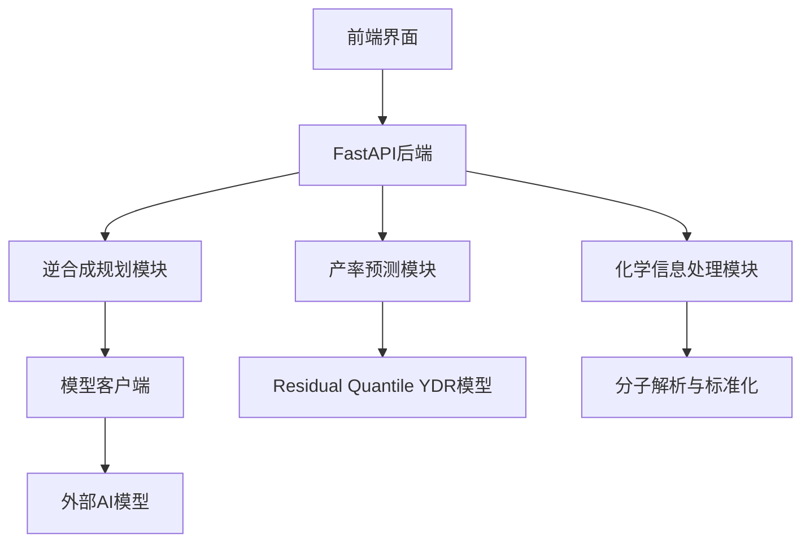

# RetrosynthesisClaw 软件设计文档 (SDD)

## 1. 项目概述

### 1.1 项目目的
RetrosynthesisClaw 是一个智能逆合成分析平台，旨在通过 AI 驱动的方法为复杂有机分子生成可行的合成路线，并预测每一步反应的产率。

### 1.2 项目范围
- **核心功能**：逆合成路线预测、产率预测、分子结构可视化
- **技术栈**：Python、FastAPI、RDKit、PyTorch
- **应用场景**：药物研发、有机合成规划、化学教育

### 1.3 项目目标
- 提供准确的逆合成路线预测
- 实现反应产率的定量预测
- 提供用户友好的前端界面
- 支持多种分子输入方式（SMILES、IUPAC名称）

## 2. 术语与缩略语

| 术语 | 解释 |
|------|------|
| SDD | Software Design Document，软件设计文档 |
| SMILES | Simplified Molecular Input Line Entry System，简化分子线性输入系统 |
| IUPAC | International Union of Pure and Applied Chemistry，国际纯粹与应用化学联合会 |
| RDKit | 开源化学信息学软件包 |
| FastAPI | 现代、快速的Web API框架 |
| PyTorch | 深度学习框架 |
| ECFP | Extended-Connectivity Fingerprints，扩展连接性指纹 |
| YDR | Yield Distribution Regression，产率分布回归 |
| AI | Artificial Intelligence，人工智能 |
| API | Application Programming Interface，应用程序编程接口 |

## 3. 总体架构

### 3.1 模块划分



### 3.2 数据流图

1. **输入处理**：用户输入目标分子（SMILES或名称）→ 分子标准化 → 结构验证
2. **逆合成分析**：目标分子 → 模型预测 → 路线生成 → 路线评估
3. **产率预测**：反应步骤 → 分子特征提取 → 模型预测 → 结果整合
4. **输出展示**：路线可视化 → 产率展示 → 用户交互

### 3.3 技术栈约束

| 技术 | 版本 | 用途 |
|------|------|------|
| Python | ≥ 3.9 | 主要开发语言 |
| FastAPI | ≥ 0.115.0 | Web API框架 |
| uvicorn | ≥ 0.30.0 | ASGI服务器 |
| RDKit | ≥ 2023.09.1 | 化学信息处理 |
| PyTorch | ≥ 2.0.0 | 深度学习框架 |
| Tailwind CSS | 3.0+ | 前端样式 |
| JavaScript | ES6+ | 前端交互 |

## 4. 功能规格

### 4.1 逆合成路线预测模块

#### 4.1.1 功能描述
- 接收目标分子的SMILES或IUPAC名称
- 生成多条可能的合成路线
- 对路线进行评分和排序
- 提供详细的反应步骤和断键信息

#### 4.1.2 实现细节
- **核心类**：`RetrosynthesisOrchestrator`
- **工作流程**：
  1. 分子标准化和验证
  2. 多步逆合成预测
  3. 路线评估和筛选
  4. 结果格式化和返回

### 4.2 产率预测模型

#### 4.2.1 功能描述
- 预测反应的产率分布
- 处理单底物和双底物反应
- 提供置信区间估计

#### 4.2.2 实现细节
- **模型类型**：Residual Quantile YDR模型
- **核心类**：`YieldPredictor`、`ResidualQuantileYDRModel`
- **特征提取**：分子指纹（ECFP2）
- **损失函数**：Pairwise Ranking Loss
- **模型文件**：
  - `best_residual_quantile_ydr_vs_model.pth`
  - `residual_quantile_ydr_rf.joblib`
  - `residual_quantile_ydr_scaler.joblib`

### 4.3 分子处理模块

#### 4.3.1 功能描述
- 分子解析和标准化
- SMILES和IUPAC名称转换
- 分子结构可视化

#### 4.3.2 实现细节
- **核心类**：`MoleculeSpec`
- **功能**：
  1. 分子解析（SMILES、IUPAC名称）
  2. 结构标准化
  3. 分子属性计算
  4. 2D结构生成

### 4.4 前端界面模块

#### 4.4.1 功能描述
- 分子编辑器集成（Ketcher）
- 逆合成分析结果展示
- 产率预测结果可视化
- API配置管理

#### 4.4.2 实现细节
- **页面**：
  - `index.html`：主工作台
  - `api-config.html`：API配置页面
- **功能**：
  1. 分子绘制和编辑
  2. 逆合成分析触发
  3. 路线结果展示
  4. 产率预测结果显示
  5. API配置管理

## 5. 接口规格

### 5.1 API端点

| 端点 | 方法 | 功能 | 请求体 | 响应 |
|------|------|------|--------|------|
| `/` | GET | 首页重定向 | N/A | HTML页面 |
| `/health` | GET | 健康检查 | N/A | `{"status": "ok"}` |
| `/config` | GET | 获取配置 | N/A | 配置信息 |
| `/molecule/export` | POST | 分子信息导出 | `{"text": "CCO"}` | 分子详细信息 |
| `/molecule/image` | GET | 分子结构图像 | `smiles`参数 | PNG图像 |
| `/route` | POST | 逆合成路线预测 | `{"target": "CCO", "top_k": 3, "debug": false}` | 路线结果 |
| `/route/stream` | POST | 流式逆合成路线 | 同`/route` | 流式事件 |
| `/yield/predict` | POST | 产率预测 | `{"reactant_smiles": "CCO", "product_smiles": "CC(=O)O"}` | 产率预测结果 |
| `/yield/predict_batch` | POST | 批量产率预测 | `{"samples": [{"reactant_smiles": "CCO", "product_smiles": "CC(=O)O"}]}` | 批量预测结果 |
| `/yield/health` | GET | 产率预测服务健康检查 | N/A | 健康状态 |

### 5.2 数据结构

#### 5.2.1 分子规格（MoleculeSpec）
```python
class MoleculeSpec:
    input_text: str
    smiles: str
    canonical_smiles: str
    source_type: str
    valid: bool
    metadata: dict
```

#### 5.2.2 逆合成步骤（RetrosynthesisStep）
```python
class RetrosynthesisStep:
    step_index: int
    target_smiles: str
    precursors: List[str]
    reaction_type: str
    confidence: float
    rationale: str
    metadata: dict
```

#### 5.2.3 产率预测请求（YieldPredictRequest）
```python
class YieldPredictRequest:
    reactant_smiles: str  # 单个分子或两个分子用点分隔
    product_smiles: str
```

#### 5.2.4 产率预测响应（YieldPredictResponse）
```python
class YieldPredictResponse:
    reactant_smiles: str
    product_smiles: str
    predicted_yield: float
    rf_baseline_pred: float
    status: str
```

## 6. 非功能需求

### 6.1 性能
- **响应时间**：简单分子的逆合成分析应在10秒内完成
- **产率预测**：单个反应的产率预测应在1秒内完成
- **并发处理**：支持至少10个并发请求

### 6.2 可复现性
- **随机种子**：所有随机过程应使用固定种子
- **数据划分**：训练/验证/测试集划分应可重现
- **模型版本**：模型文件应包含版本信息

### 6.3 可维护性
- **代码规范**：遵循PEP 8编码规范
- **注释要求**：关键函数和类应有详细文档字符串
- **模块化设计**：功能应按模块清晰划分

### 6.4 可用性
- **用户界面**：直观、响应式设计
- **错误处理**：友好的错误提示
- **文档**：完整的用户指南和API文档

## 7. 数据规格

### 7.1 数据集
- **产率预测数据**：包含反应SMILES和实验产率的数据集
- **逆合成数据**：USPTO-500MT等标准数据集

### 7.2 数据预处理
- **分子标准化**：使用RDKit进行结构标准化
- **特征提取**：生成ECFP2指纹
- **数据清洗**：移除无效反应和异常值

### 7.3 模型文件
- **位置**：`public/Yieldpredict/models/`
- **文件**：
  - `best_residual_quantile_ydr_vs_model.pth`：PyTorch模型权重
  - `residual_quantile_ydr_rf.joblib`：随机森林基线模型
  - `residual_quantile_ydr_scaler.joblib`：特征标准化器
  - `residual_quantile_ydr_artifact.json`：模型元数据

## 8. 质量标准与验收准则

### 8.1 功能测试
- **逆合成测试**：对标准分子的逆合成路线生成
- **产率预测测试**：对已知产率的反应进行预测
- **API测试**：所有API端点的功能测试

### 8.2 性能测试
- **响应时间测试**：测量不同复杂度分子的处理时间
- **并发测试**：测试多用户同时访问的性能

### 8.3 代码质量
- **代码审查**：代码质量检查和审查
- **测试覆盖率**：单元测试覆盖率≥80%
- **文档完整性**：所有模块和函数的文档

### 8.4 验收标准
- 逆合成路线生成成功率≥90%
- 产率预测准确率（Spearman ρ）≥0.7
- 系统稳定运行时间≥99.9%
- 用户界面响应迅速，无明显卡顿

## 9. 实施计划

### 9.1 模块开发顺序
1. 分子处理模块
2. 产率预测模块
3. 逆合成规划模块
4. API接口层
5. 前端界面

### 9.2 测试计划
1. 单元测试：各模块的功能测试
2. 集成测试：模块间交互测试
3. 系统测试：完整流程测试
4. 性能测试：响应时间和并发测试

### 9.3 部署计划
1. 开发环境搭建
2. 测试环境部署
3. 生产环境部署
4. 持续集成/持续部署配置

## 10. 风险评估

### 10.1 技术风险
- **模型准确性**：产率预测模型的准确性可能受限于训练数据质量
- **计算资源**：复杂分子的逆合成分析可能需要大量计算资源
- **依赖管理**：第三方库的版本兼容性问题

### 10.2 应对策略
- **数据增强**：使用数据增强技术提高模型泛化能力
- **缓存机制**：实现结果缓存，减少重复计算
- **依赖锁定**：使用固定版本的依赖库

## 11. 未来扩展

### 11.1 功能扩展
- **多步产率预测**：考虑反应序列的产率累积效应
- **溶剂和催化剂优化**：纳入溶剂和催化剂对产率的影响
- **立体化学考虑**：考虑立体异构体对反应的影响

### 11.2 技术扩展
- **模型集成**：集成更多先进的深度学习模型
- **分布式计算**：支持分布式逆合成搜索
- **自动化实验设计**：基于预测结果推荐实验条件

## 12. 结论

RetrosynthesisClaw 项目是一个集成了逆合成路线预测和产率预测的智能化学合成规划平台。通过模块化设计和先进的AI技术，它能够为有机化学家提供有价值的合成路线建议和产率预测，加速药物研发和材料科学的创新过程。

该项目的设计遵循了软件工程的最佳实践，包括模块化架构、详细的接口定义、全面的测试计划和清晰的文档。这些设计决策确保了项目的可维护性、可扩展性和可靠性，为未来的功能扩展和技术升级奠定了坚实的基础。